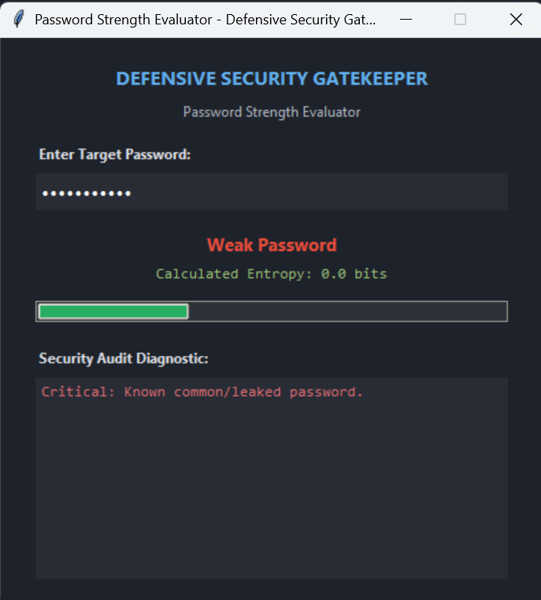
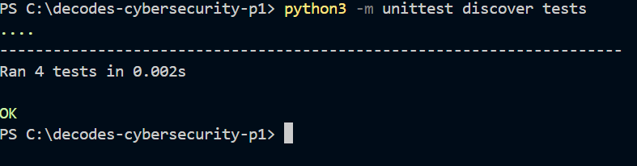

# Defensive Password Strength Checker

A security-first password strength evaluation utility and GUI application built with Python and Tkinter for the DecodeLabs Cybersecurity Internship (Project 1).

## Key Features
- **Entropy-Based Evaluation:** Computes Shannon entropy $$E = L \times \log_2(R)$$ to measure brute-force resistance.
- **Defensive Memory Hygiene:** Uses mutable byte buffers with explicit zeroing to mitigate plaintext residue in RAM.
- **Timing-Safe Blacklist Verification:** Implements `hmac.compare_digest` for constant-time comparisons against common leaked passwords.
- **The Gatekeeper Rule:** Validates password quality before downstream storage or encryption.
- **Automated Unit Tests:** Verified using Python's `unittest` framework.

### 1. Application User Interface

### 2. Unit Testing & Security Validation

---

## 🛡️ Core Defensive Security Principles

### 1. The Gatekeeper Rule: Validation Before Encryption
- **Principle:** Storing weak passwords in hashed form (e.g., Argon2id or bcrypt) still leaves systems vulnerable to dictionary and brute-force attacks.
- **Implementation:** The `GatekeeperValidator` acts as a frontline gatekeeper, blocking low-entropy inputs before they reach downstream storage pipelines.

### 2. Side-Channel Timing Attack Prevention
- **Principle:** Standard string comparison operators (`==`) exit early on character mismatches, leaking timing clues to attackers measuring execution speeds.
- **Implementation:** Common leaked password checks and confirmation verifications utilize constant-time comparison algorithms via `hmac.compare_digest`.

### 3. Mitigating Data Remanence in Memory (RAM)
- **Principle:** Standard Python strings are immutable and linger in system memory until garbage collected, exposing plaintext credentials to heap-scraping malware.
- **Implementation:** Sensitive inputs are processed using mutable byte buffers (`bytearray`) that are explicitly zeroed out in memory immediately after evaluation.

---

## ⚙️ Mathematical Metric: Shannon Entropy

Password resilience against brute-force attacks is quantified using the Shannon entropy formula:

$$E = L \times \log_2(R)$$

- **$E$**: Entropy in bits.
- **$L$**: Password length.
- **$R$**: Character pool size based on character variety (lowercase, uppercase, numbers, symbols).

| Entropy Level | Classification | Security Level |
| :--- | :--- | :--- |
| **< 36 bits** | Weak | High vulnerability to brute-force attacks |
| **36 – 54 bits** | Medium | Moderate resistance |
| **≥ 55 bits** | Strong | High resistance to brute-force guessing |

---

